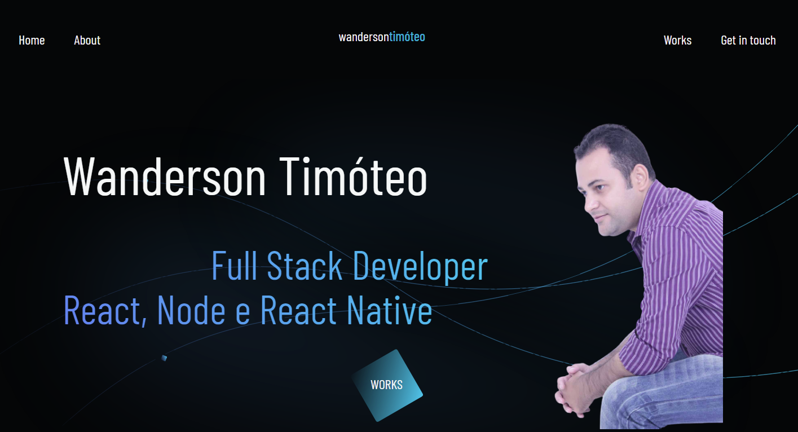

<h1 align="center">
    
</h1>

  <a href="#-projeto">Projeto</a>&nbsp;&nbsp;&nbsp;|&nbsp;&nbsp;&nbsp;
  <a href="#-tecnologias">Tecnologias</a>&nbsp;&nbsp;&nbsp;|&nbsp;&nbsp;&nbsp;
  <a href="#-executar aplicação">Executar Aplicação</a>&nbsp;&nbsp;&nbsp;|&nbsp;&nbsp;&nbsp;
  <a href="#-licença">Licença</a>

 

  

 

## 💻 Projeto

O projeto foi desenvolvido durante a semana FrontWeek.  
Esta aplicação é um exemplo de portfólio com animações, desenvolvido com SASS. Consiste em um sistema para apresentar seu currículo web. 💜

## Acessar o domínio do projeto

- [Portfólio](https://wanderson-a-timoteo.github.io/portfolio)

 

### Prévia vizualização do sistema

    

 

## 🚀 Tecnologias

Esse projeto foi desenvolvido com as seguintes tecnologias:

- [Javascript](https://wanderson-a-timoteo.github.io/portfolio)
- [Sass](https://sass-lang.com/)
- [HTML5](https://developer.mozilla.org/pt-BR/docs/Web/HTML/HTML5)
- [CSS3](https://www.tutorialspoint.com/css/css3_tutorial.htm)
- [Figma](https://www.figma.com/)

 

- [Ferramenta para obter variação de cores: ](https://www.youtube.com/redirect?event=video_description&redir_token=QUFFLUhqa2VuRlF6bTlxa2haaVVlV3RJVVJwN001M2hoZ3xBQ3Jtc0tuckZ5R2NFZ3VFU3h2TjBHYTNqYnZmeDJ4N2tvNWpVM29iNzdHR1I5ZGtSQjIxb1hHeE91YlNodW50RC1IOU0zSEtpOTBTTjR0YjF6QlFaLVY4TzV6bDF0SWRQS0RjWTBna3RBS0RidHZINExRNDJ2OA&q=https%3A%2F%2Fhihayk.github.io%2Fscale%2F%234%2F6%2F35%2F46%2F-0%2F0%2F20%2F14%2F2DC7ED%2F45%2F199%2F237%2Fwhite)

### Design do projeto

[Figma](https://www.youtube.com/redirect?event=video_description&redir_token=QUFFLUhqa2xRLW5kQjdLSjI3djhpaUt3WlBQZ0hhRC1pUXxBQ3Jtc0tuVzdwRkgwaEhtYlhmOWx2STh0aTRKUWxYQm1XUlpRMlhUdnhPZ2dKbW9qbDdzRHZQZl9NOGVfVFRkZEZ1RnYtbTk2QS1JeXp4VWJrMnlHT18yVkZvbjk3dFBYWmxHSXZHaFV5Tkl5U0xORWhJdTdINA&q=https%3A%2F%2Fwww.figma.com%2Ffile%2FvxNy2e2MYzFE41JrOhUrph%2FFrontWeek-Portf%25C3%25B3lio%3Fnode-id%3D2%253A3)

---

 

## Executar Aplicação

## 🔥 Executando Localmente a Aplicação

Caso você deseja executar o projeto na sua máquina local, basta seguir os passos abaixo:

### 🌀 Começando...

Para começar, você deve simplesmente clonar o repositório do projeto na sua máquina.

 

#### 💨 Executando a Aplicação

Bom, agora **(dentro da pasta `portfolio` do projeto clonado)** abra o arquivo index.html, com um duplo clique.

Pronto! dessa forma o projeto estará rodando localmente em sua maquina.

 

### 🚩 Tenho Dúvidas... O que fazer?

Caso tenham dúvidas sobre o código do projeto, sintam-se a vontade em abrir uma **[ISSUE AQUI](https://github.com/Wanderson-A-Timoteo/portfolio/issues)**. Assim que possível, estarei respondendo as todas as dúvidas que tiverem!

---

## Licença

Esse projeto está sob a licença MIT. Veja o arquivo [LICENSE](LICENSE.md) para mais detalhes.

---

## Autor:

Feito com ♥ by

- [**Wanderson A. Timóteo**](https://wandersontimoteo.ga)

## Agradecimentos:

<h1 align="center">
    
</h1>

- Projeto desenvolvido durante a Semana [FrontWeek: ](https://www.nyousefali.com.br/).

- Agradecimento a [Násser Yousef Ali](https://github.com/nyousefali) por compartilhar conteúdo relevante e com qualidade de ensino.
